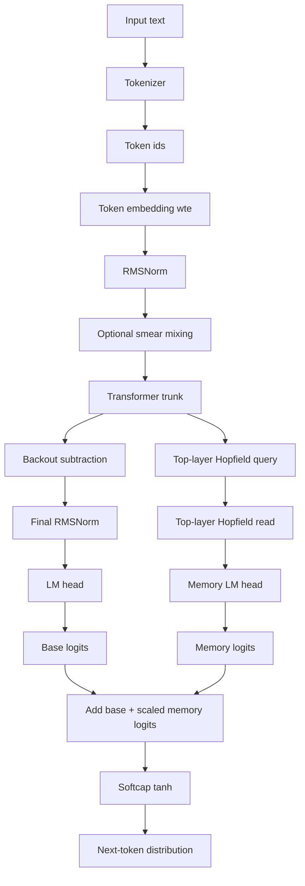
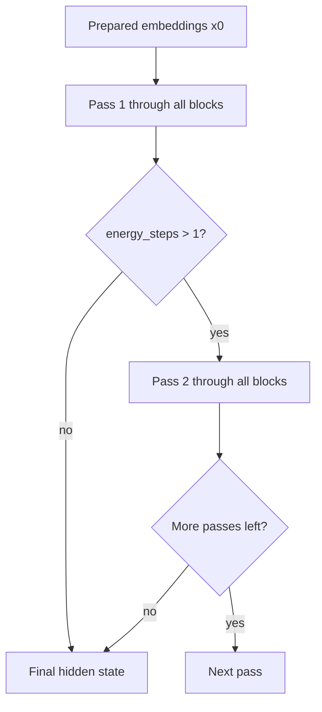
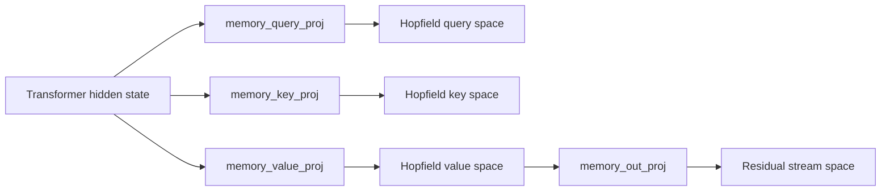
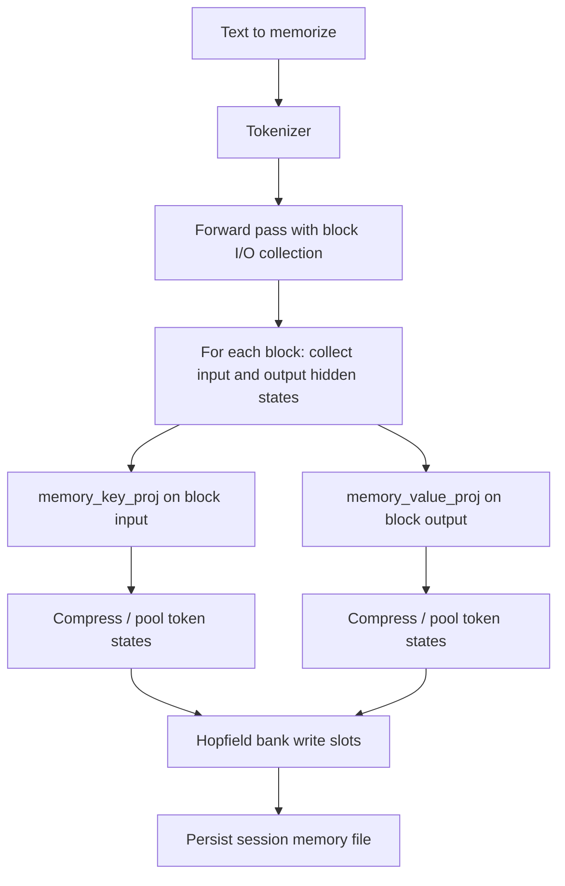
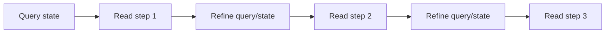
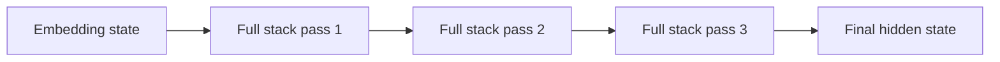
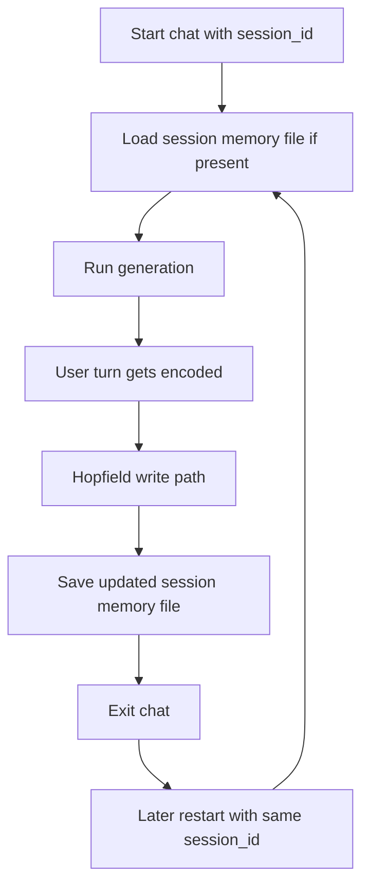

# NanoChat Transformer + Hopfield Memory Architecture

This document explains how the current NanoChat model works at a high level, with a special focus on the Transformer stack, the projected Hopfield memory path, and the runtime controls for `energy_steps` and `hopfield_steps`.

The implementation described here corresponds to the current code in:

- `nanochat/gpt.py`
- `nanochat/hopfield.py`
- `scripts/chat_cli.py`
- `scripts/chat_web.py`

## 1. Big Picture

NanoChat is still a causal language model, so the main job of the network is unchanged:

1. tokenize text
2. embed tokens into vectors
3. process them through a stack of Transformer blocks
4. produce next-token logits

The difference is that each block now also has a **projected Hopfield memory path**.

- The Transformer does normal next-token modeling.
- The Hopfield memory gives each block a persistent associative memory bank.
- `energy_steps` lets the whole block stack run multiple times on its own hidden state.
- `hopfield_steps` lets each Hopfield read do multiple internal retrieval refinements.

## 2. End-to-End Forward Pass



## 3. Transformer Trunk

The trunk is still a stack of Transformer blocks, but it can now run more than once.

- `energy_steps = 1`: exactly one full pass through all blocks
- `energy_steps > 1`: the output hidden state is fed back into the block stack again

Conceptually:



This is important because it gives the model more compute without adding more tokens.

## 4. Inside One Transformer Block

Each block has three major residual updates:

1. self-attention
2. Hopfield memory read
3. MLP

```mermaid
flowchart TD
    X[Block input x] --> A[Residual blend with x0]
    A --> B[Self-attention on norm(x)]
    B --> C[Add attention residual]
    C --> D[Projected Hopfield read on x]
    D --> E[Add memory residual]
    E --> F[MLP on norm(x)]
    F --> G[Add MLP residual]
    G --> H[Block output]
```

So in simplified math:

```text
x = attention_update(x)
x = x + hopfield_memory_update(x)
x = x + mlp_update(x)
```

## 5. Why The Hopfield Path Uses Projections

The model does **not** write raw Transformer hidden states directly into the Hopfield bank anymore.

Instead, each block has:

- `memory_query_proj`
- `memory_key_proj`
- `memory_value_proj`
- `memory_out_proj`

This gives the memory system its own learned latent space.



Why this matters:

- querying memory is not the same problem as writing memory
- a useful memory key is not necessarily the same representation as the output value
- the base Transformer hidden space stays cleaner

## 6. Hopfield Read Path

Each block can read from a persistent slot-based memory bank.

```mermaid
flowchart TD
    X[Current block hidden state x] --> N1[norm(x)]
    N1 --> Q[memory_query_proj]
    Q --> H1[HopfieldMemoryBank.read]
    H1 --> S[Similarity against stored keys]
    S --> T[Top-k or full softmax retrieval]
    T --> V[Weighted sum of stored values]
    V --> O[memory_out_proj]
    O --> G[Gate via sigmoid(memory_bank.gate)]
    G --> R[Residual memory contribution]
```

Inside the bank:

- stored state is slot-based: keys, values, weights
- retrieval is associative
- the read can itself iterate for `hopfield_steps`

If `hopfield_steps = 0`:

- reads return zeros
- writes are disabled
- Hopfield memory is effectively off

## 7. Hopfield Write Path

At runtime, memory is written after a user interaction.

The write path works like this:



Key properties:

- memory is written per layer
- writes are persistent across sessions when `session_id` is used
- writes are skipped entirely if `hopfield_steps = 0`

## 8. Hopfield Iteration vs Energy Iteration

These two knobs are different.

### `hopfield_steps`

This controls the **inner** iterative retrieval inside one Hopfield read.



### `energy_steps`

This controls the **outer** recurrence across the whole Transformer trunk.



So:

- `hopfield_steps` deepens memory retrieval
- `energy_steps` deepens whole-network refinement

## 9. Memory-to-Logits Path

The model also has a direct path from retrieved memory into logits.

This is separate from the normal residual memory update inside each block.

```mermaid
flowchart TD
    A[Final hidden state x] --> B[Top block memory_query_proj]
    B --> C[Top block Hopfield read]
    C --> D[memory_lm_head]
    D --> E[Memory logits]
    F[Normal LM head logits] --> G[Add logits]
    E --> G
    G --> H[Scaled by sigmoid(memory_logit_scale)]
    H --> I[Final logits]
```

This path exists because sometimes the memory signal is easier to decode directly into token logits than only through the residual stream.

## 10. Runtime Session Flow

When you use `--session-id`, the model keeps a separate memory file on disk.



The session file stores:

- per-layer Hopfield bank contents
- no Python dict-based factual memory
- no text retrieval cache

## 11. Control Knobs

Current runtime behavior:

- `energy_steps=1` means one full pass through the Transformer trunk
- `energy_steps>1` means repeated full-stack refinement
- `hopfield_steps=0` disables Hopfield reads and writes
- `hopfield_steps=1` means a single Hopfield retrieval step
- `hopfield_steps>1` means iterative Hopfield refinement during each read

Examples:

```bash
# Single transformer pass, no Hopfield memory
python -m scripts.chat_cli --energy-steps 1 --hopfield-steps 0

# Single transformer pass, one Hopfield retrieval step
python -m scripts.chat_cli --energy-steps 1 --hopfield-steps 1

# Three transformer passes, two Hopfield retrieval refinements
python -m scripts.chat_cli --energy-steps 3 --hopfield-steps 2
```

## 12. Honest Summary

The architecture now has three important ideas:

1. a standard causal Transformer backbone
2. a projected, persistent Hopfield memory bank in every block
3. iterative compute knobs at two levels:
   - whole-network recurrence via `energy_steps`
   - memory retrieval recurrence via `hopfield_steps`

This keeps memory inside the model path rather than pushing it into symbolic runtime scaffolding.
